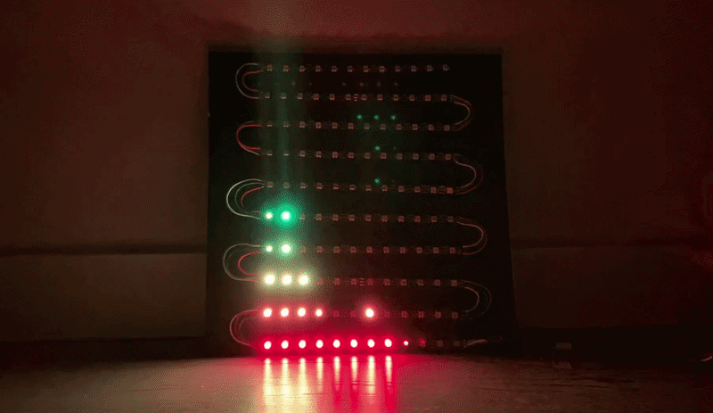
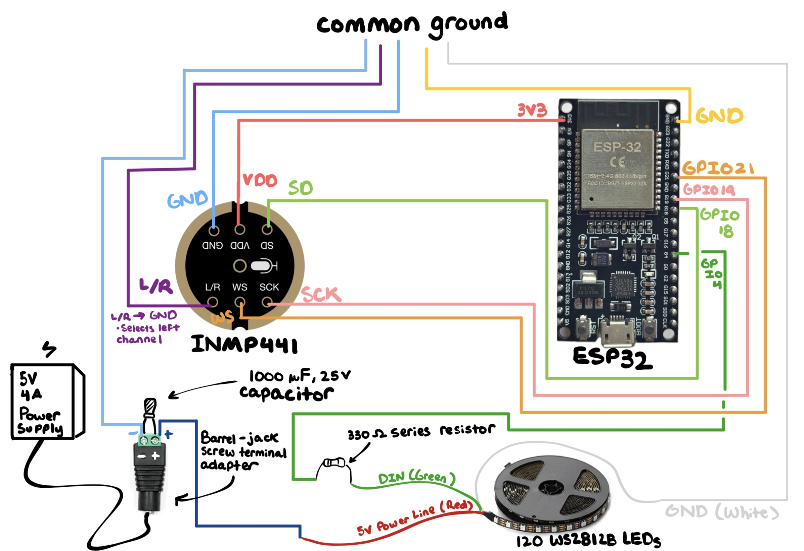
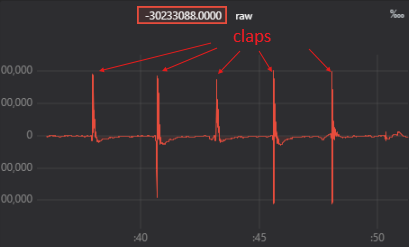
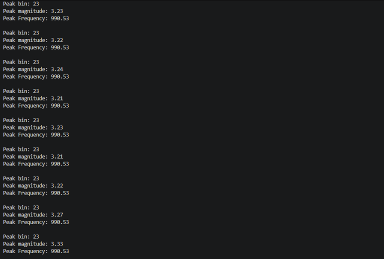

# ESP32 Audio Spectrum LED Visualizer

A real-time audio spectrum visualizer that uses an ESP32 and INMP441 I²S microphone to perform Fast Fourier Transform frequency analysis and display the spectrum on a 120-LED matrix.

## Key Results

- Uses a 1024-sample FFT at a 44.1 kHz sample rate
- Achieves approximately 43.1 Hz frequency resolution per FFT bin
- Divides approximately 0 to 16 kHz of the spectrum across 12 frequency bands
- Verified a 1 kHz input tone at FFT bin 23 which corresponds to approximately 990.5 Hz
- Displays audio on a 10 × 12 WS2812B LED matrix for a total of 120 LEDs
- Verified continuity across all 120 LEDs
- Uses separate magnitude thresholds for lower and higher frequency bands to improve visual responsiveness
- Suppresses background noise using configurable noise-floor thresholds
- Successfully demonstrated real-time response to sounds and music

   
  <em>Real-time music demonstration: the 12 LED columns visualize the detected frequency spectrum as the audio is processed.</em>

  <a href="./docs/videos/music_demo.mp4">▶ View full demonstration video</a>

## Overview

This project describes a real-time audio spectrum visualizer using an ESP32 as the microcontroller, INMP441 I²S as the microphone and a WS2812B as the LED display. The system uses the INMP441 microphone to continuously pick up audio data. It converts them into samples and the signal is processed using Fast Fourier Transform in the frequency domain. From the FFT, the various resulting frequency ranges are then converted into LED bar heights that respond to the audio that is being detected.

Audio is received from the INMP441 microphone and then travels to the ESP32's I²S peripheral at a sample rate of 44.1 kHz. I²S uses 32-bit I²S slots to accommodate the microphone's 24-bit audio data. The ESP32 is able to receive samples through a DMA-based I²S buffer and collects 1024 valid mono samples before the FFT operation is performed.

The ESP32 accumulates a valid 1024-sample frame across multiple DMA-based I²S reads, which is then processed using `arduinoFFT` as the library. Before the FFT is executed, the DC component (k = 0) is removed and the function enables Hamming Window to reduce spectral leakage. The FFT function then results in magnitude values and each frequency bin represents a range of the captured frequency spectrum.

The frequency spectrum is made up of 12 bands which match up with the 12 columns of the WS2812B LED display. To determine the height of each band, the largest FFT magnitude is selected and is mapped onto as a vertical LED height. A noise floor is implemented so small background noises (such as a fan, AC or vibrations) are not continuously shown on the display. Different amplitude thresholds were used for both the lower and higher frequency bands so the display remains visually responsive across the frequency spectrum.

The LED display is assembled using a continuous and addressable WS2812B LED strip aligned in a serpentine matrix. To match the serpentine ordering with the front-facing display, a mapping function converts logical row and column coordinates into the corresponding physical LED index that is along the strip. Therefore, each frequency band controls one vertical column of the matrix, whilst the number of illuminated LEDs represents the detected peak magnitude within that frequency range.

The complete system demonstrates a real-time visual representation of incoming audio, with the rows representing signal magnitude and the columns representing frequency bands.

## Architecture

### <u>I²S Microphone</u>

Audio gets received by the INMP441 digital MEMS microphone which travels to the ESP32 using its I²S peripheral. The I²S mode is configured as the master (where it generates the clock and sends the WS to the mic) and as the receiver (to continuously receive the serial data from the INMP441).

The INMP441 provides 24-bit signed samples in several 32-bit I²S slots. Since INMP441 is mono, only one channel contains the valid audio data. This is configured using INMP441's L/R pin where the left I²S channel is selected by connecting the pin to ground. The ESP32 receives both left and right slots, at which every other 32-bit slot is selected in software to disregard the right channel and select the valid mono samples.

The I²S peripheral uses DMA-based buffering. Therefore, audio data can be received continuously without needing the ESP32 to manage every individual sample as it arrives. DMA temporarily stores the incoming I²S data while the processor retrieves the samples in chunks using `i2s_read()`. Every I²S read returns a set of 32-bit I²S slots, in which the microphone samples are obtained before being passed to the FFT input buffer.

Since INMP441 provides 24 bits of necessary audio data inside the 32-bit I²S slots, the received data are shifted by 8 bits to align the signed 24-bit sample. The sample is divided by 2^23 to normalize values between -1 and +1.

The samples are continuously accumulated across 32 DMA-based I²S reads until there are 1024 valid mono samples. These 1024 samples form one complete audio frame and are then stored in the FFT input array. Once the frame is filled, the sample set is passed to the FFT stage, in which sample collection begins for the subsequent frame.

### <u>FFT Processing</u>

Once 1024 valid samples are retrieved, the frame is processed using the `arduinoFFT` library. Before any calculation is made, DC component (k = 0) is taken out so that any constant offset does not change the freq. analysis. To diminish potential spectral leakage between neighboring freq. bins, Hamming window is applied.

FFT converts the samples from time-domain to freq. domain. FFT bins can be calculated from the sampling rate and the number of samples:

$$
44100 \div 1024 = 43.1 \text{ Hz}
$$

Since the input signal is real-valued, the FFT output is symmetric and only the first half contains unique freq information. This means the useful freq. range extends from 0 Hz up to 22.05 kHz corresponding to the Nyquist frequency.

Once FFT is calculated, the complex output is then converted to magnitude values where every FFT bin represents the strength of the audio signal within its small freq. range. Then, the magnitude values are used by the next step to group the spectrum into freq. bands which are represented by LED columns.

### <u>Frequency Band Mapping</u>

After the FFT magnitudes are calculated, the freq. spectrum is divided into 12 freq. bands, with each band matching to one column of the LED display. Since the visualizer uses 12 columns, each column represents a different portion of the captured audio spectrum.

The freq. bands are split evenly in terms of FFT bins. 16 kHz was chosen as the max displayed freq. since most useful audible content lies below this range. Knowing this, the number of total bins can be calculated from max freq. being divided by the bin width:

$$
16 \text{ kHz} \div 43.1 \text{ Hz}= 372 \text{ total bins}
$$

$$
372 \text{ bins} \div 12 \text{ columns}= 31 \text{ bins per column}
$$

Therefore, the display uses 31 FFT bins per column. The mapping begins at bin 1 since the DC component at bin 0 is removed. With each bin representing approx. 43.1 Hz, an LED column is just about:

$$
31 \times 43.1 = 1336 \text{ Hz}
$$

Because of the LED's serpentine ordering, the peak magnitudes must first determine how many LEDs should be illuminated vertically in each column. The system then uses an LED mapping function that takes the row and column as logical inputs. This is then converted into the corresponding physical LED positions along the strip. The LED mapping function makes it so the lowest freq. band will be on the left side of the display whereas the highest freq. band will be on the right side.

### <u>Amplitude to Row Mapping</u>

After the peak magnitude for each freq. band is found, the magnitude must be converted into a vertical LED height. A noise floor is first applied so that low-level background signals do not continuously activate the display.

The usable magnitude range is then divided into row thresholds. Each threshold corresponds to a different LED height, where a larger peak magnitude results in more LEDs being illuminated vertically in that column.

For a 10-row implementation, the lower and higher freq. bands use different magnitude thresholds. The thresholds were calibrated through trial and error and testing so that the display is responsive across the entire freq. range. Higher frequencies had lower magnitude thresholds and were more sensitive to weaker signals whereas the lower frequencies had higher magnitude thresholds.

Each threshold will correspond to a different LED height and having a larger peak magnitude will have more illuminated rows. Values below the configured noise floor result in a height of zero, while values at or above the highest threshold illuminate all ten LEDs in the column. Also important to note that through testing, the column that had the lowest frequency (`col = 0` in the code) had a noise floor of 1.9 to suppress background noise such as an AC or vibrations.

The resulting row height is then used to find the total number of vertically illuminated LEDs for each of the 12 freq. columns. Each LED row is assigned its own color, creating a rainbow gradient from the bottom to the top as the amplitude increases.

## Hardware Implementation

### <u>Components</u>

The audio visualizer uses the ESP32 board as the main controller, an INMP441 digital MEMS microphone for audio input and two 60-LED WS2812B strips to form a 10 × 12 LED matrix with 120 LEDs total.

The main components used for this project include:

- ESP32 development board
- INMP441 I²S microphone
- 120 WS2812B addressable LEDs
- 5 V (4 A) external power supply
- 1000 µF electrolytic capacitor
- 330 Ω resistor
- Breadboard
- Jumper wires
- Barrel-jack screw terminal adapter
- Micro-USB cable
- 12 × 12 inch cork tile for mounting

The WS2812B LEDs are powered by an external 5 V (4 A) supply rather than directly from the ESP32. By having the ESP32 and LED power supply share a common ground, the LED data signal uses the same electrical reference. LED brightness is also limited in software using `FastLED.setBrightness(50)` to reduce the current demand of the 120-LED display.

### <u>Wiring</u>

The ESP32 and INMP441 are able to communicate with one another using the I²S protocol. The microphone is powered using ESP32's 3.3 V pin and both share a common ground with the rest of the system. The I²S connections are:

- INMP441 VDD → ESP32 3.3 V
- INMP441 GND → ESP32 GND
- INMP441 SD → GPIO18
- INMP441 SCK/BCLK → GPIO19
- INMP441 WS/LRCLK → GPIO21
- INMP441 L/R → GND

The microphone transmits its audio data through the left I²S channel since L/R pin is set to ground.

The WS2812B data input is connected and controlled by the GPIO4 pin on the ESP32. A 330 Ω resistor is placed in series with the LED data line to ensure stability. The LED strip receives 5 V from the external power supply while its ground is connected to the common ground shared with the ESP32 and the INMP441.

A 1000 µF capacitor is placed across the LED power supply's 5 V and ground connections to help reduce voltage fluctuations when the LED load changes. The external power supply is connected to the circuit using a barrel-jack screw terminal adapter.

The physical connections between the ESP32, microphone, LED strip and external power source are made using a breadboard and jumper wires. A simplified wiring diagram can be described as:

### <u>Physical Layout and Assembly</u>

The LED display is constructed from a continuous WS2812B strip arranged into 10 rows and 12 columns in serpentine ordering. The first row starts at the bottom right of the display and moves horizontally across the row. Every following row reverses direction, allowing the LED strip to continue back across the display without requiring a separate data connection for every row.

The LED strip is cut into sections to create the individual rows of the matrix. Wires are soldered between the cut LED sections so that power, ground and data remain electrically continuous while the strip changes direction between rows.

Soldering is also used to attach the required connections to the INMP441 microphone and to connect the LED strip wires to jumper wires. These jumper connections allow the microphone and LED system to interface with the breadboard during assembly and testing.

The completed LED matrix is mounted onto a 12 × 12 inch cork tile, which provides a lightweight surface for holding the rows in their intended positions. The serpentine physical arrangement is handled in software using the LED mapping function so that logical row and column coordinates correspond to the correct physical LED indices along the continuous strip.

Note: since the first row begins from the bottom right, the LED mapping function reverses the column order so that the lower freq. is on the left side and the higher freq. is on the right side.

## Verification and Results

### <u>I²S Microphone Test</u>

Tested the raw sample output from the INMP441 microphone and the I²S communication. The samples were read by the ESP32 and then plotted using Teleplot.

The microphone was tested in a silent environment and then followed by several claps. During quiet periods, the signal remained close to the baseline. Each clap would produce clear amplitude spikes which confirmed that the ESP32 was successfully receiving audio samples from the INMP441 through the I²S protocol.

### <u>Tone Frequency Test</u>

A frequency test was used to verify that the FFT correctly identifies the dominant frequency and bin of an input signal. A 1 kHz sine wave was played through a speaker and was captured by the INMP441 microphone.

With the system having a sample rate of 44.1 kHz and an FFT size of 1024 samples, each FFT bin represents approximately:

$$
44.1 \text{ kHz} \div 1024 \text{ samples}= 43.1 \text{ Hz per bin}
$$

A 1 kHz input signal would therefore be closest to FFT bin 23 which is approximately 990.5 Hz.

The test demonstrates that the ESP32 detected bin 23 as the dominant FFT bin with a peak frequency of 990.5 Hz. This difference from 1 kHz is expected since FFT has a finite freq. resolution of approx. 43.1 Hz per bin.

Console log:

### <u>LED Continuity Test</u>

This test verifies the complete 120 LED chain. Each physical LED was illuminated from LED 0 to LED 119 and then again in reverse from LED 119 back to LED 0.

All 120 LEDs were illuminated successfully in both passes, thus confirming continuity through the soldered LED sections and confirming the LED strip could be controlled by the ESP32.

The test also used the same row colors as the final display visualizer, allowing the proper rainbow color progression to be checked at the same time.

   
  <em>LED continuity demonstration: all 120 LEDs are illuminated sequentially in both directions to verify the complete LED chain.</em>

### <u>Silence and Response Test</u>

The completed visualizer was tested in a quiet environment to verify the configured noise floor thresholds. During silence, the LED matrix remained completely dark instead of picking up any potential background noise such as an AC or fan.

Then claps were done intermittently to produce an immediate response from the LED display. After the sound ended, the matrix would return to an inactive state. This confirmed that the noise floor suppresses background noise while the display still reacts quickly to intentional audio cues.

   
  <em>Silence and response demonstration: the display remains inactive during silence and responds immediately to claps before returning to the inactive state.</em>

  <a href="./docs/videos/clap_response.mp4">▶ View full silence and response video</a>

## How to Run

1. Connect the INMP441 microphone to the ESP32 using the I²S wiring described in the Hardware Implementation section.
2. Connect the WS2812B LED matrix to GPIO4 through the 330 Ω resistor.
3. Power the LED strip using the external 5 V supply and ensure that the LED power supply and ESP32 share a common ground.
4. Open the project in PlatformIO and install the required libraries:
   - arduinoFFT
   - FastLED
5. Connect the ESP32 to the computer through USB and upload the firmware to the board.
6. Power the WS2812B matrix using the external 5 V supply. Once the ESP32 begins running, audio from the INMP441 is continuously sampled and processed in 1024-sample frames.
7. The FFT results are divided into 12 freq. bands and displayed across the 12 LED columns. Lower freq. bands appear on the left side of the display while higher freq. bands appear on the right.
8. The Serial Monitor can optionally be opened at 115200 baud for debugging and monitoring the ESP32 while the visualizer is running.
